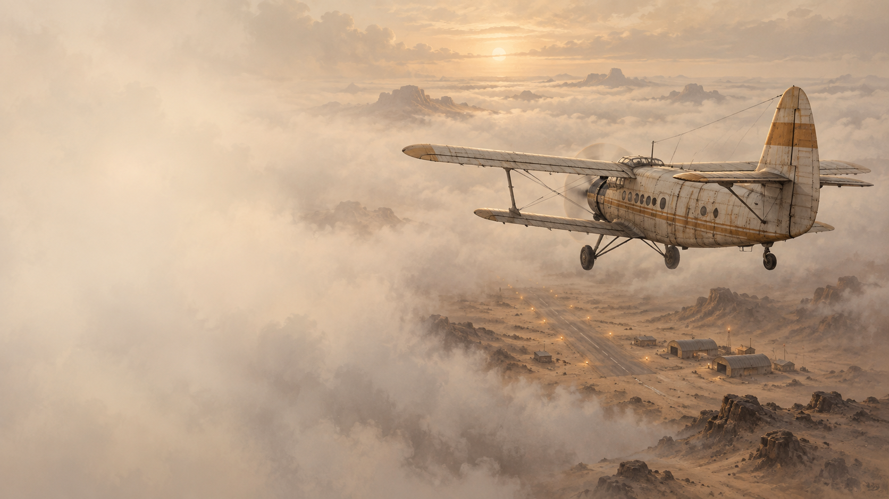

# Far Flight

[](https://delorum.github.io/FarFlight/)

### [▶ Играть в браузере](https://delorum.github.io/FarFlight/)

Игра, минималистичный симулятор полета на самолете по приборам.

Вы — почтальон-пилот. Между затерянными аэродромами почтовая авиация связывает людей: посылки, письма и вести издалека должны добраться до адресата. Выбирайте заказы, загружайте самолёт и составляйте выгодные маршруты для нескольких доставок.

Но здесь небо почти никогда не бывает ясным. Уже в ста метрах над землёй начинается сплошная облачность. Дальше — полёт по приборам: курс, высота, скорость, сигналы радиомаяков и ваши пометки на карте. После вылета положение самолёта на ней скрывается — его предстоит определять самостоятельно.

Учитывайте ветер, обходите горы и грозы, планируйте посадки и остановки. Топливо, еда, гостиницы и ремонт есть не везде. Пилоту нужно есть и отдыхать, а самолёт постепенно изнашивается. Конечной денежной цели нет: летайте, доставляйте почту, улучшайте маршруты и собственные рекорды.

## Содержание

- [Быстрый старт](#быстрый-старт)
- [Мир и начало игры](#мир-и-начало-игры)
- [Управление](#управление)
  - [Самолёт](#самолёт)
  - [Карта и метеорадар](#карта-и-метеорадар)
  - [Салон и аэропорт](#салон-и-аэропорт)
  - [Время и пауза](#время-и-пауза)
- [Полётная модель и приборы](#полётная-модель-и-приборы)
  - [Высота, скорость и экономичный режим](#высота-скорость-и-экономичный-режим)
  - [Питание, двигатель и планирование](#питание-двигатель-и-планирование)
  - [Радиовысотомер](#радиовысотомер)
  - [Износ планера](#износ-планера)
- [Навигация](#навигация)
  - [Навигационная карта](#навигационная-карта)
  - [Расчёт полёта](#расчёт-полёта)
  - [Радиомаяки](#радиомаяки)
  - [ILS и посадка](#ils-и-посадка)
- [Погода](#погода)
  - [Ветер](#ветер)
  - [Грозы и метеосводка](#грозы-и-метеосводка)
  - [Метеорадар](#метеорадар)
- [Аэропорты и экономика](#аэропорты-и-экономика)
  - [Услуги и цены](#услуги-и-цены)
  - [Почта](#почта)
  - [Груз и заправка](#груз-и-заправка)
  - [Сытость и бодрость](#сытость-и-бодрость)
  - [Подготовка к вылету](#подготовка-к-вылету)
- [Посадка, статистика и окончание полёта](#посадка-статистика-и-окончание-полёта)
- [Сохранения](#сохранения)
- [Запуск и разработка](#запуск-и-разработка)
  - [Локальный запуск](#локальный-запуск)
  - [Web и GitHub Pages](#web-и-github-pages)
  - [Архитектура](#архитектура)
- [Авторы](#авторы)

## Быстрый старт

Первый вылет уже оплачен и подготовлен. Включите питание клавишей `P`, запустите двигатель клавишей `M`, увеличьте газ клавишей `W`. После разгона примерно до 70 км/ч возьмите штурвал на себя стрелкой вниз.

Для горизонтального крейсерского полёта ориентируйтесь примерно на 87% газа и 200 км/ч. Точное положение зависит от высоты и ветра. Перед следующими вылетами потребуется посетить лётную службу, оплатить подготовку и выбрать направление полосы.

## Мир и начало игры

Карта размером 200×200 км генерируется процедурно. В каждом из четырёх районов 100×100 км находятся два аэродрома и четыре маршрутных радиомаяка. Любые два аэродрома разделяет не менее 45 км.

Перед новой игрой можно ввести положительный `seed` от 1 до 2147483647 или оставить поле пустым. Один и тот же seed воспроизводит рельеф, аэродромы, маяки, услуги и последовательность погоды. Его можно передать другому игроку для сравнения рекордов в одинаковом мире. Seed указан на кнопке «Продолжить» в начальном меню и меню паузы.

На заставке доступны продолжение или итоги сохранённой игры, новая игра, «Об игре», «Авторы» и выход.

## Управление

### Самолёт

- `W` / `S` — увеличить / уменьшить газ;
- `P` — включить или выключить питание приборов;
- `M` — запустить или остановить двигатель;
- стрелки вверх/вниз — штурвал по тангажу: вверх/от себя для снижения, вниз/на себя для набора;
- стрелки влево/вправо — без задержки отклонить штурвал и изменить курс;
- `Shift` + стрелка влево/вправо — поправить курс на 0,1°; удержание меняет его со скоростью 0,1° в секунду без отклонения штурвала;
- мышь по рычагу газа или штурвалу — прямое управление;
- `X` — выйти в салон или вернуться за штурвал из любой точки салона.

По горизонтали штурвал автоматически возвращается в центр. Установленное продольное положение сохраняется.

### Карта и метеорадар

- колесо над картой — изменить масштаб;
- ЛКМ с перемещением — двигать карту;
- два коротких клика ЛКМ — провести измерительную линию;
- перетаскивание конца — изменить линию; связанные общим концом линии движутся вместе;
- ПКМ — отменить незавершённую линию или удалить ближайшую готовую;
- колесо над радиоприёмником — изменить частоту на 1 кГц, с `Shift` — на 10 кГц;
- `B` или клик по метеорадару — переключить карту и большой радар;
- колесо над большим радаром — выбрать дальность 30, 20, 10 или 5 км;
- кнопка траектории — показать или скрыть маршрут завершённого полёта.

### Салон и аэропорт

- стрелки или ЛКМ — идти либо мгновенно переместиться в боковой сцене;
- `Enter` или клик по активному объекту — взаимодействовать;
- `X` — вернуться в кресло пилота;
- колесо вниз в салоне — открыть отдалённый боковой вид; доступны три масштаба;
- колесо вверх, `Enter` или `Esc` в отдалённом виде — вернуться в салон;
- из здания можно выйти кнопкой или клавишей `Enter`; `Esc` открывает меню паузы.

Клик по двери, креслу, столу или стулу сразу выполняет переход. Простое прохождение рядом не активирует объект.

### Время и пауза

- `Shift+Z` — переключать 1×, 2×, 4×, 8× и 16×;
- `Z` — немедленно вернуть 1×;
- `Space` — поставить симуляцию на паузу или продолжить её в любой сцене;
- `Esc` — открыть меню паузы.

Управление самолётом или персонажем после ускорения возвращает время к 1×. Работа с картой и её линиями ускорение не сбрасывает. Возникшее в грозе вращение самолёта сбрасывает ускорение немедленно.

## Полётная модель и приборы

Панель содержит воздушную и путевую скорости, барометрическую и радиовысоту, вертикальную скорость, компас, авиагоризонт, часы, топливный прибор, два радиоприёмника, ILS и метеорадар. Часы начинают отсчёт в день 1 в 00:00:00 и используют то же время, что журнал полётов.

Высотомер размечен через 50 и 100 м, спидометр — через 25 и 50 км/ч, вариометр — через 1 и 5 м/с. На компасе оставлены N/E/S/W. Точные значения выводятся под приборами.

### Высота, скорость и экономичный режим

Расход снижается до оптимума около 425 м, затем снова растёт. После 450 м двигатель быстро теряет избыточную мощность, набор практически прекращается к 600 м, абсолютный предел модели — 700 м. Высокие хребты приходится обходить по долинам и перевалам.

Голубые полосы спидометра и высотомера показывают диапазоны не хуже 95% от максимальной расчётной дальности для текущего направления и ветра. Для каждой высоты отдельно подбирается выгодная скорость. Когда радиовысотомер видит землю, красная риска на высотомере отмечает её абсолютную высоту, а голубая рекомендация пересчитывается только среди эшелонов не ниже 50 м над этой отметкой. На земле рекомендации не показываются; расчёт обновляется не чаще раза в реальную секунду.

Запас хода рассчитывается по путевой скорости. Счётчик под часами накапливает фактически пройденный над землёй путь. Топливный прибор показывает экономию или штраф расхода относительно уровня моря.

### Питание, двигатель и планирование

Питание можно включить без двигателя и расхода топлива. Отключение питания останавливает двигатель; повторное включение запускает только приборы. Для запуска двигателя нужны питание и разрешение на вылет.

Без питания работают механические указатели скорости, высоты, вертикальной скорости и часы. Электрические приборы и метеорадар гаснут.

В штиль с нейтральным штурвалом самолёт без двигателя планирует примерно на 100 км/ч со снижением около 3,6 м/с. Сильное взятие штурвала на себя расходует скорость и может вызвать сваливание; отдача от себя позволяет восстановиться. Планирование плавно начинается ниже 10% газа.

### Радиовысотомер

Под циферблатом первая крупная строка показывает барометрическую высоту: `… м`. На второй строке рядом выводятся `РВ … м • ЗЕМ … м`: радиовысота и абсолютная высота земли непосредственно под самолётом. Значение `ЗЕМ` соответствует красной риске на шкале и всегда рисуется голубым; ниже 100 м показание `РВ` становится красным.

Радиовысотомер работает при включённом питании до 750 м включительно. Вне его диапазона или без питания вместо `РВ` и `ЗЕМ` выводятся прочерки. Прибор показывает рельеф только под самолётом, но не впереди него.

### Износ планера

Планер начинает со 100 единиц состояния и медленно изнашивается в полёте. Выше безопасной скорости износ растёт квадратично; в грозе он увеличивается к ядру. Нулевое состояние приводит к разрушению самолёта.

На панели показаны целостность и износ за игровую минуту. В боковых сценах используется компактный индикатор. Ремонт доступен в специальных ангарах.

## Навигация

### Навигационная карта

До начала движения карта показывает самолёт на аэродроме вылета. После вылета положение скрывается. Итоговая траектория также скрыта в полёте; после завершения её можно включать и выключать, оставляя символ конечного положения.

Измерительная линия показывает расстояние, время, прямой и обратный курсы и максимальную высоту рельефа. Для короткой линии подпись размещается рядом горизонтально; при наведении те же сведения появляются слева внизу. Точки прилипают только к маякам и концам существующих линий, но не к середине отрезка.

### Расчёт полёта

На карте расположен сворачиваемый и перемещаемый калькулятор с четырьмя вкладками. Значения вводятся без `Enter` с точкой или запятой либо меняются колесом.

Он связывает расстояние, время, воздушную и вертикальную скорости, начальную и конечную высоты, направление пути, курс носа и ветер. Расстояние — неизменный якорь вкладки: оно меняется только вручную или при изменении связанной линии. Остальные параметры пересчитывают друг друга. Невозможный расчёт подсвечивается красным, но не обнуляет маршрут.

Кнопки «Текущая» подставляют параметры самолёта. Обновление «Высоты 1» подставляет ветер на этой высоте; затем его можно изменить вручную. Расчёт предполагает постоянный режим и не учитывает грозовые порывы.

«Привязать к линии» связывает вкладку с отрезком. Перемещение концов обновляет расчёт, а изменение расстояния или направления двигает конечную точку. Активная линия красная, прочие связанные — оранжевые. «Обратно» разворачивает направление на 180°.

### Радиомаяки

Маршрутные NDB действуют в радиусе 30 км, посадочные маяки — 15 км. NDB генерируются на низких открытых участках. Рельеф высотой от 250 м между самолётом и антенной может блокировать сигнал; прибор различает выход за дальность и закрытие рельефом. Это упрощённая модель средневолнового сигнала в горах.

### ILS и посадка

ILS использует приёмник 1. Настройте частоту посадочного маяка: прибор включится в пределах 15 км, внутри переднего сектора и при подходящем курсе носа. Вертикальная метка показывает отклонение от створа, горизонтальная — от глиссады 3,3°. Зелёный цвет означает попадание в допуск.

На двух подробных масштабах карты пунктиром показан сектор захвата: боковые границы идут от дальнего торца ВПП, дальняя дуга находится в 15 км от маяка. Для каждого аэродрома отмечена точка входа в заход с требуемыми высотой и вертикальной скоростью.

Ориентир для захода газом: выйти на продолжение полосы в 6 км от дальнего маяка на высоте около 230 м и скорости 100 км/ч, поставить нейтральный тангаж и 30% газа. Примерно в 2,05 км от маяка убрать газ до 10%. Устойчивый участок проходит на 90–92 км/ч по глиссаде около 3°.

## Погода

### Ветер

Ветер задан на высотах 0, 250, 500 и 700 м и интерполируется между ними. Он влияет на путевую скорость, снос, запас хода и экономичные режимы. Новая погода генерируется после завершённой посадки; уход на второй круг её не меняет.

### Грозы и метеосводка

Грозы могут возникать над аэродромами и подходами. Они движутся, вызывают турбулентность и ускоряют износ.

На карте показан статичный снимок гроз: бледные жёлтые, оранжевые и красные зоны повторяют метеорадар, а контур фиксирует положение в момент сводки. Её возраст указан слева сверху. При наведении показываются приблизительные направление и скорость грозы.

«Обновить метеосводку» в лётной службе бесплатно снимает текущие положения гроз, не меняя физическую погоду. Отображение отключается кнопкой слева от ILS. Последовательность погодных циклов определяется seed и числом завершённых посадок.

### Метеорадар

Большой радар центрирован на самолёте и имеет масштабы 30, 20, 10 и 5 км. Изображение гроз обновляется раз в секунду и плавно вращается с курсом; скрытый радар и радар на паузе не обновляются. При наведении показываются движение, направление и скорость грозы.

На радаре можно рисовать отдельные линии. Они привязаны к местности, но не переносятся на карту, не прилипают к её точкам и не рассчитывают рельеф. Линия удаляется, когда оба конца оказываются дальше 30 км от самолёта.

## Аэропорты и экономика

### Услуги и цены

В каждом аэропорту есть почта и лётная служба. Заправка, магазин, гостиница и ремонт находятся только в трёх аэропортах каждого типа; без дополнительных услуг остаётся не более двух аэродромов.

Для каждой услуги один аэропорт на 30% дешевле базовой цены, один имеет базовую цену, один на 30% дороже.

| Услуга | Базовая цена |
| --- | ---: |
| Топливо | 2 монеты/л |
| Пустая канистра | 15 монет |
| Еда | 20 монет |
| 20 минут гостиницы | 10 монет |
| Ремонт | 3 монеты за единицу |
| Подготовка к вылету | 12 монет |

Стартовый капитал — 160 монет. После посещения хотя бы двух магазинов одного типа карта показывает рейтинг известных цен: `(+)` — дешевле, затем `(++)` и `(+++)`. Непосещённые цены не раскрываются.

### Почта

Почта предлагает три посылки в разные аэропорты и обновляет ассортимент после посадки в другом аэропорту. Расстояние заказа строится по кратчайшему проходимому пути при пределе 700 м и запасе 150 м над рельефом.

Оплата растёт немного быстрее расстояния и учитывает бедность назначения: без дополнительных услуг +35%, с одной +20%, с двумя +10%. Фактические километры выплату не увеличивают. Сроков нет: можно брать несколько посылок и строить многоэтапный маршрут.

### Груз и заправка

Посылки, еду и двадцатилитровые канистры нужно перенести в самолёт. В салоне шесть грузовых ячеек: клик по пустой кладёт предмет, по занятой — берёт. Предмет можно уложить или выбросить.

На заправке отдельно покупаются канистра и топливо. Ползунки работают с шагом 0,1 л. В техническом отсеке канистру можно перелить в бак; последний неполный шаг точно заполняет его. В отсек ведут стрелка вниз у подъёма в кабину и клик по заправочному устройству.

### Сытость и бодрость

Сытость и бодрость имеют по шесть делений и уменьшаются раз в игровой час. Нулевое значение завершает игру.

Еда восстанавливает одно деление. Есть можно только за столом: возьмите еду, сядьте кликом или `Enter`, затем нажмите `Enter` или «Съесть». Само усаживание еду не расходует.

На кровати каждые 20 непрерывных минут возвращают бодрость, но только до двух. Гостиница восстанавливает её до шести платными периодами по 20 минут. Спать там можно и при полной бодрости, чтобы промотать время.

### Подготовка к вылету

Первый вылет подготовлен бесплатно. После завершённой посадки и полной остановки разрешение снимается: нужно оплатить подготовку и выбрать направление ВПП. Повторный выбор оплаченной полосы бесплатен; деньги списываются снова только при смене направления.

Выход в салон на земле останавливает двигатель, но не отменяет подготовку до взлёта. Ручная остановка и запуск также сохраняют разрешение. Без подготовки двигатель не запускается; причина выводится красным.

## Посадка, статистика и окончание полёта

Касание не завершает рейс. До полной остановки можно добавить газ и уйти на второй круг; погода и разрешение при этом не меняются.

Лётная служба хранит статистику рейсов. Общий журнал показывает последние сверху: аэродромы, фактическое расстояние, длительность и время начала и конца. Для повторённых направлений есть список от самого быстрого результата к медленному.

Во время прогулки по салону полёт продолжается. При большом угле атаки или сваливании появляется предупреждение. После крушения открывается карта с причиной, расстоянием, временем и траекторией. Слот заменяется сохранением завершённого прохождения: историю, seed и маршрут можно посмотреть, но продолжить полёт нельзя.

## Сохранения

В настольной версии слот находится по адресу `user://flight_save.dat`. «Сохранить и выйти» сначала записывает его и только затем закрывает игру. При ошибке игра остаётся открытой, прежний слот сохраняется. Новая игра не удаляет старый слот до успешного сохранения.

Сохраняются мир, погода и сводка, самолёт и пилот, экономика, почта, груз, приборы, карта, линии карты и радара, вкладки калькулятора, рейс, траектория, журнал, сцена и персонаж. Повреждённый или несовместимый файл не загружается.

В браузере слот хранится в `localStorage` под ключом `farflight.save.v5`. Он принадлежит браузеру и адресу сайта, не синхронизируется с настольной версией и может исчезнуть после очистки данных или приватного сеанса. Закрытие вкладки само игру не сохраняет.

## Запуск и разработка

Игра создана на Godot 4.7.

### Локальный запуск

Откройте `project.godot` в Godot 4.7 и запустите проект (`F5`). Главный экран — `scenes/game_shell.tscn`; запуск `scenes/main.tscn` через `F6` пропускает меню и предназначен для разработки и тестов.

### Web и GitHub Pages

Профиль `Web` использует Compatibility/WebGL 2 без потоков и service worker. Для локальной сборки нужны Godot 4.7 и export templates:

```sh
mkdir -p build/web
godot --headless --editor --path . --import
godot --headless --path . --export-release Web build/web/index.html
python3 -m http.server 8000 --directory build/web
```

Откройте `http://localhost:8000`, а не `index.html` через `file://`.

Workflow `.github/workflows/web-pages.yml` при push в `main` и вручную запускает тесты, собирает Web-версию и публикует GitHub Pages. Для pull request выполняется сборка без публикации. Архив доступен как `FarFlight-Web`.

Ссылки: [веб-экспорт Godot](https://docs.godotengine.org/en/stable/tutorials/export/exporting_for_web.html), [GitHub Pages через Actions](https://docs.github.com/en/pages/getting-started-with-github-pages/using-custom-workflows-with-github-pages).

### Архитектура

- `FlightWorld` отвечает за seed, рельеф, аэродромы, коридоры, погоду и маяки;
- `FlightModel` хранит состояние самолёта и динамику независимо от интерфейса;
- `FlightPlanSolver` выполняет чистый расчёт маршрута;
- `EconomyModel` хранит деньги, потребности, услуги, почту и груз;
- `main.gd` координирует модели, сцены и ввод;
- карта, приборная панель и боковые сцены вынесены в модули;
- `aircraft_art.gd` рисует самолёт снаружи и в разрезе.

Подробности описаны в [ARCHITECTURE.md](ARCHITECTURE.md).

Рендеринг ограничен 60 FPS с VSync. Карта кэшируется и перерисовывается при генерации, изменении размера, масштаба, положения или линий. Приборы обновляются отдельно. Профиль рельефа обновляется 10 раз в секунду, метеорадар — раз в секунду.

Арт заставки: `assets/title_screen.png`; исходное описание: `assets/title_screen_prompt.md`.

## Авторы

[github.com/delorum](https://github.com/delorum)
